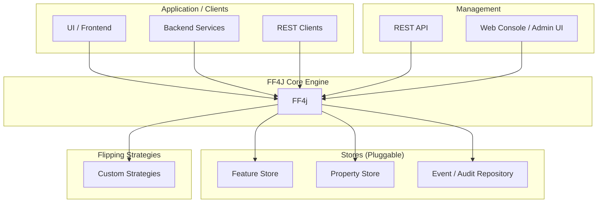

# Architecture

The architecture of **FF4j** is designed to be modular and scalable, allowing for easy maintenance
and future growth. It consists of several key components that work together to provide a seamless
user experience.

## Overview

### Application / Clients

This is your application. It can be:

- A web UI
- Backend services
- External systems calling REST APIs

These clients interact with FF4j(FF4j Core Engine) to check feature states and make decisions whether to enable or disable based on them.

### Management

This component provides interfaces for managing features, properties, and events. It includes:

- REST API: For programmatic access to manage features and properties.
- Web Console / Admin UI: A user-friendly interface for administrators to manage features and view events

### FF4j Core Engine

This is the central decision maker. The judge that evaluates all rules before allowing a feature. The responsibility of this component is to:

- Check if a feature exists
- Check if it is enabled
- Apply flipping strategies (rules)
- Check permissions
- Record events (if configured)

### Stores (Pluggable)

FF4j supports pluggable stores for features, properties, and events. This allows you to choose the storage solution that best fits your needs. Check the [stores documentation](../../../stores/overview/index.md) for more details.

### Flipping Strategies

Flipping strategies are the rules that determine whether a feature is enabled or not. FF4j provides several built-in strategies, and you can also create custom strategies to implement your specific logic. Check the [flipping strategies documentation](../../../flipping-strategies/overview/index.md) for more details.