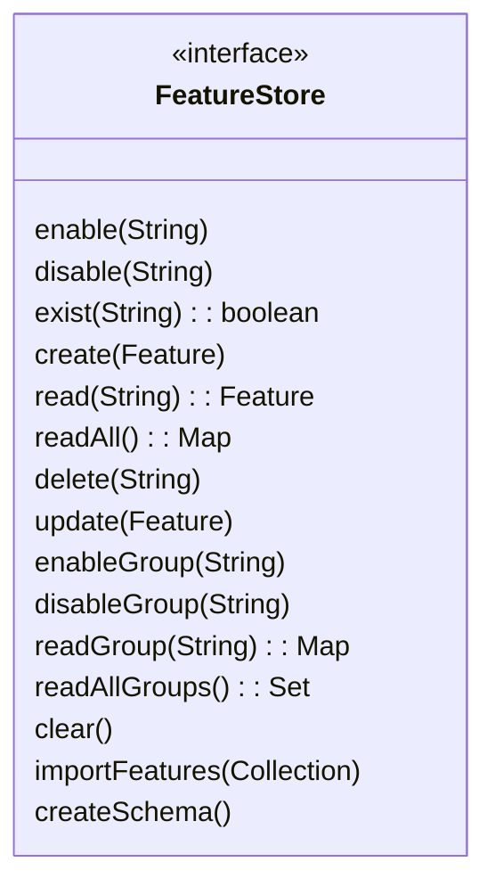

# Feature Store

The **Feature Store** is a critical component of FF4J that manages the storage and retrieval of feature toggles. It provides a centralized repository for all feature definitions, including their states (enabled/disabled), descriptions, groups, permissions, and any associated flipping strategies.

## Overview

The Feature Store is designed to be pluggable, allowing you to choose from various storage backends based on your application's needs. Common implementations include in-memory stores, relational databases, NoSQL databases, and file-based stores.

You will find CRUD operations and utility method to interact with features (createSchema, grantPermissions,). They are a dozen implementations for different technologies as detailed in the [Store documentation](../../../stores/overview/index.md).

## FeatureStore object



## Examples

### Initialize FF4j with a Feature Store

```java title="Snippet for initializing FF4j with a Feature Store"
// Using InMemoryFeatureStore
FeatureStore featureStore = new InMemoryFeatureStore();
FF4j ff4j = new FF4j(featureStore);
```

### Create and Manage Features via Feature Store

```java title="Snippet for creating and managing features"
// Create a new feature
Feature newFeature = new Feature("new-feature", false, "This is a new feature");
ff4j.getFeatureStore().create(newFeature);
// Enable the feature
ff4j.getFeatureStore().enable("new-feature");
// Check if the feature exists
boolean exists = ff4j.getFeatureStore().exist("new-feature");
// Read the feature
Feature feature = ff4j.getFeatureStore().read("new-feature");
// Disable the feature
ff4j.getFeatureStore().disable("new-feature");
// Delete the feature
ff4j.getFeatureStore().delete("new-feature");
```

