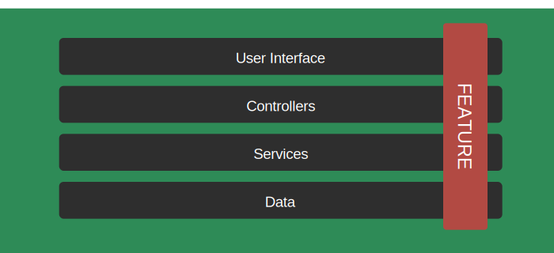
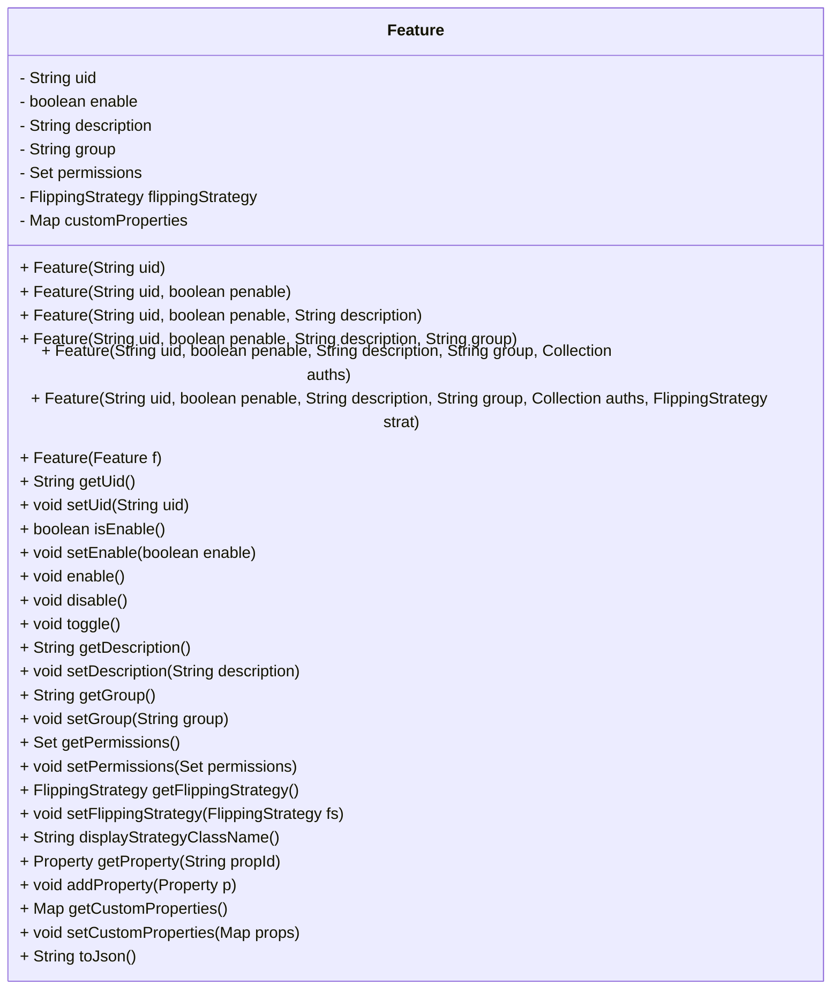

# Feature

The **Feature** term is used to represent functionality or treatment in an application. It is 
identified by a unique identifier (uid).

## Overview

A Feature models a unit of application behavior whose state can be changed at runtime. Features can
affect any layer of an application, from the user interface to data access. FF4J provides
integration points for each layer (see the illustration).



A feature toggle (or feature flag) allows you to enable or disable functionality at runtime,
controlling how the code executes without redeploying.

Each feature acts as a flag. For a feature with identifier `f1`, the code snippet to check its state
looks like:

```java title="Snippet for checking the state of a feature"
if (ff4j.check("f1")) {
    System.out.println("The feature 'f1' is 'ON'");
} else {
    System.out.println("The feature 'f1' is 'OFF'");
}
```

## Feature object

With the library FF4J, a [`Feature`](https://github.com/ff4j/ff4j/blob/main/ff4j-core/src/main/java/org/ff4j/core/Feature.java) is an object with multiple attributes (not only identifier and state):

- A text **description** to explain the purpose
- An _optional_ **groupName** to toggle multiple features at once (see [`FeatureGroup`](../../advanced-concepts/feature-groups/index.md))
- An _optional_ **set of permissions** to implement RBAC access. (see [`Permissions`](#permissions-and-security))
- An _optional_ **flipping strategy** to implement your predicates (see [`FlippingStrategy`](../../../flipping-strategies/blacklist/index.md)) 
- A **key/value map** named `customProperties` to create some context



## Examples

### Create a feature

```java title="Snippet for creating a feature"
// feature f1 is created with default values (disabled, no description, no group, no permissions, no flipping strategy)
Feature f1 = new Feature("f1");
// feature f2 is created with custom values (enabled, description, no group, no permissions, no flipping strategy)
Feature f2 = new Feature("f2", true, "This is feature f2");
```

### Check the state of a feature

```java title="Snippet for checking the state of a feature"
if (ff4j.check("f1")) {
    System.out.println("The feature 'f1' is 'ON'");
} else {
    System.out.println("The feature 'f1' is 'OFF'");
}
```

### Enable/Disable a feature

```java title="Snippet for enabling/disabling a feature"
// To toggle 'ON' the feature 'f1'
ff4j.enable("f1");
// To toggle 'OFF' the feature 'f1'
ff4j.disable("f1");
```