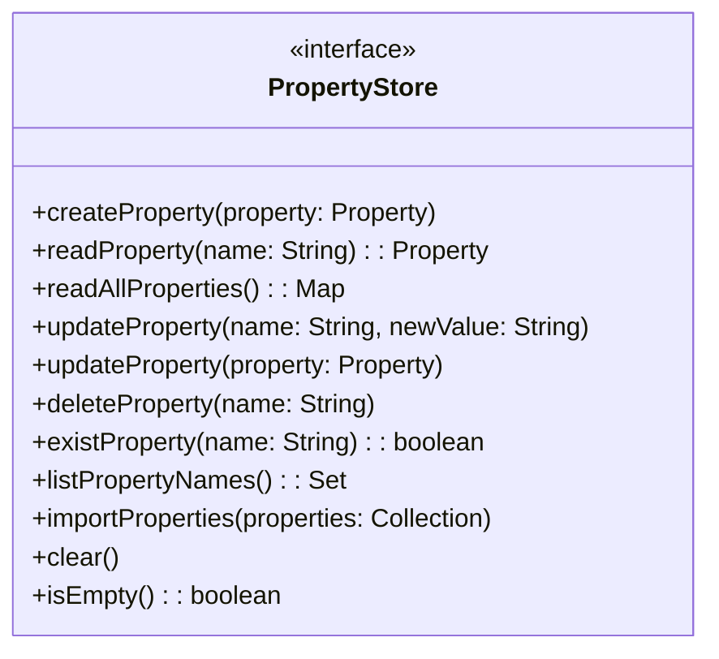

# Property Store

The **Property Store** is a core component of FF4J responsible for storing and retrieving application properties and configuration values. It provides a centralized repository for property definitions, including keys, values, data types, descriptions, scopes, and permissions, and supports retrieval, updates, and persistence across different backends.

## Overview

The [**`PropertyStore`**](https://github.com/ff4j/ff4j/blob/v1/ff4j-core/src/main/java/org/ff4j/property/store/PropertyStore.java) is designed to be pluggable, allowing you to choose from various storage backends based on your application's needs. Common implementations include in-memory stores, relational databases, NoSQL databases, and file-based stores.

They are a dozen implementations for different technologies as detailed in the [Store documentation](../../../stores/overview/index.md).

## PropertyStore object



## Examples

### Initialize FF4j with a Property Store

```java title="Snippet for initializing FF4j with a Property Store"
public void initializeFF4jWithPropertyStore() {
  // Using InMemoryPropertyStore
  PropertyStore propertyStore = new InMemoryPropertyStore();
  FF4j ff4j = new FF4j().setPropertyStore(propertyStore);
}
```

### Create and Manage Properties via Property Store

```java title="Snippet for creating and managing properties"
public void createAndManagePropertyViaPropertyStore() {
  // Create a new property
  Property<String> newProperty = new PropertyString("app.theme", "dark");
  ff4j.getPropertyStore().createProperty(newProperty);
  // Read the property
  Property<String> property = ff4j.getPropertyStore().readProperty("app.theme");
  // Update the property value
  ff4j.getPropertyStore().updateProperty("app.theme", "light");
  // Delete the property
  ff4j.getPropertyStore().deleteProperty("app.theme");
}
```