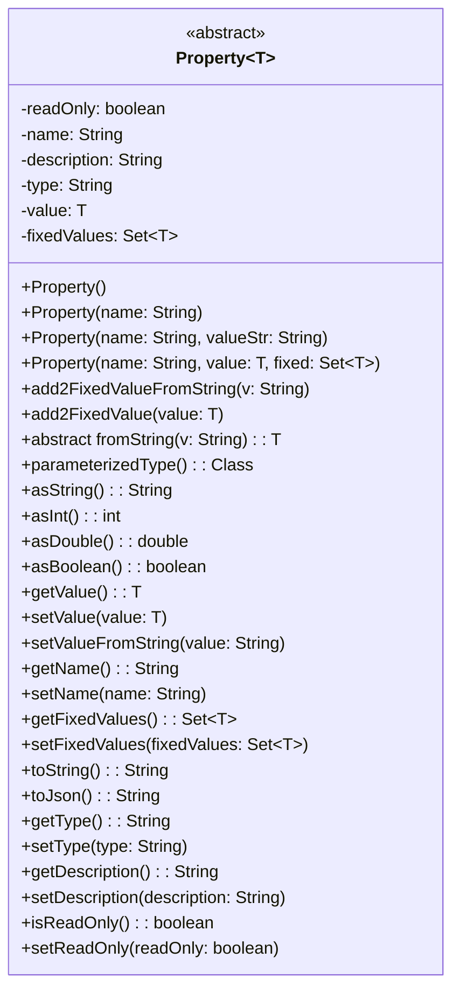

# Property

Property represents a configuration parameter that can be associated with features or used
independently within the FF4J framework. Properties allow you to store various types of data, such
as strings, integers, booleans, and more, which can be utilized to control feature behavior or
application settings.

## Overview

A [**`Property`**](https://github.com/ff4j/ff4j/blob/main/ff4j-core/src/main/java/org/ff4j/property/Property.java)
is an entity representing any kind of value or configuration. It has an unique name and a value.
This value can be of any type and this the reason why, in ff4j, we chose to implement it with
generics **`Property<?>`**. There is a Property implementation for each Java Raw Type as shown in
the example below.

## Property object



## Examples

### Create and Manage Properties

```java title="Snippet for creating and managing properties"
public void createAndManageProperty() {
  // Create a new String property
  PropertyString myProp = new PropertyString("myStringProp", "defaultValue");
  ff4j.getPropertyStore().create(myProp);
  // Retrieve the property
  PropertyString retrievedProp = (PropertyString) ff4j.getPropertyStore().read("myStringProp");
  // Update the property value
  retrievedProp.setValue("newValue");
  ff4j.getPropertyStore().update(retrievedProp);
  // Delete the property
  ff4j.getPropertyStore().delete("myStringProp");
}
```

### Using Properties in Features

```java title="Snippet for using properties in features"
public void usePropertyInFeature() {
  // Create a feature with a custom property
  Feature featureWithProp = new Feature("featureWithProp", true);
  PropertyInt timeoutProp = new PropertyInt("timeout", 30);
  featureWithProp.addProperty(timeoutProp);
  ff4j.getFeatureStore().create(featureWithProp);
  // Retrieve and use the property
  Feature retrievedFeature = ff4j.getFeatureStore().read("featureWithProp");
  PropertyInt retrievedTimeoutProp = (PropertyInt) retrievedFeature.getProperty("timeout");
  int timeoutValue = retrievedTimeoutProp.getValue();
}
```

### Custom Property Implementation

```java title="Snippet for creating a custom property type"
import org.ff4j.property.Property;
import org.ff4j.test.property.CardinalPoint.Point;

public class CardinalPoint extends Property<Point> {

  private static final long serialVersionUID = 1792311055570779010L;

  public static enum Point {NORTH, SOUTH, EAST, WEST};

  public CardinalPoint(String uid, Point lvl) {
    super(uid, lvl, Point.values());
  }

  public Point fromString(String v) {
    return Point.valueOf(v);
  }

  public void north() {
    setValue(Point.NORTH);
  }

  public void south() {
    setValue(Point.SOUTH);
  }

  public void east() {
    setValue(Point.EAST);
  }

  public void west() {
    setValue(Point.WEST);
  }
}
```