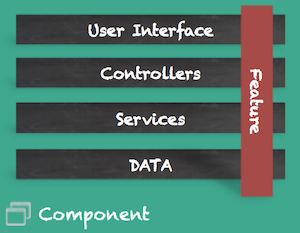
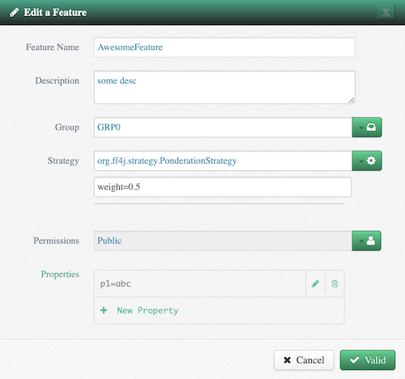

<link rel="stylesheet" href="https://maxcdn.bootstrapcdn.com/font-awesome/4.6.1/css/font-awesome.min.css">

### Overview

The [`Feature`](https://github.com/clun/ff4j/blob/master/ff4j-core/src/main/java/org/ff4j/core/Feature.java) term is used to represent functionality or treatment in an application. 
It is identified by an unique identifier (uid). 

A Feature represents a business logic that can potentially crosses every layer 
of applications from user interfaces to data access. Therefore, to implement 
a feature toggle mechanism, we must help you in each layer as shown with the 
picture on the right.



Feature toggle,_or feature flag_, purpose is to evaluate the state of features at runtime to drive the execution of your code. You can change the state of features at runtime (enable and disable, toggle `ON/OFF`). 

Each feature is associated as a flag. 
Given a feature with identifier `f1` we want to write in the code:

```java
if (ff4j.check("f1")) {
  System.out.println("The feature 'f1' is 'ON'");
} else {
  System.out.println("The feature 'f1' is 'OFF'");    
}
```

### `Feature` object

With the library `FF4J`, a feature is an object with multiple attributes (not only identifier and state): 

- A text **description** to explain the purpose
- An _optional_ **groupName** to toggle multiple features at once (see [`FeatureGroup`](#group))
- An _optional_ **set of permissions** to implement RBAC access. (see [`Permissions`](#permissions-and-security))
- An _optional_ **flipping strategy** to implement your predicates (see [`FlippingStrategy`](#flipping-strategy))
- A **key/value map** named `customProperties` to create some context

    ```mermaid
    classDiagram
    Feature --* FlippingStrategy
    Feature --* Property
    
    Feature : enable()
    Feature : disable()
    Feature : toJson()
    Feature : fromJson(...)  
    Feature : getters()
    Feature : setters()
    Feature : String uid
    Feature : boolean enable
    Feature : String description
    Feature : String group
    Feature : Set<String> permissions
    Feature : Map<String,Property> customProperties
    FlippingStrategy : getInitParams()
    FlippingStrategy : evaluate()
    Property : name
    Property : value
    ```

### Sample codes

You can interact with the `Feature` object programmatically :

```java
Feature f1 = new Feature("f1");
Feature f2 = new Feature("f2", false, "sample description");
```

- Feature with **Permissions**:

```java
Set < String > permission = new HashSet<String>();
permission.add("BETA-TESTER");
permission.add("VIP");
Feature f3 = new Feature("f3", false, "desc", "GROUP_1", permission);
```

- Feature with **Custom Properties**:

```java
Feature f4 = new Feature("f4");
f4.addProperty(new PropertyString("p1", "v1"));
f4.addProperty(new PropertyDouble("pie", Math.PI));
f4.addProperty(new PropertyInt("myAge", 12));
```

- Feature with `FlippingStrategy`

```java
Feature f5 = new Feature("f5");
Calendar nextReleaseDate = Calendar.getInstance();
nextReleaseDate.set(Calendar.MONTH, Calendar.SEPTEMBER);
nextReleaseDate.set(Calendar.DAY_OF_MONTH, 1);
f5.setFlippingStrategy(new ReleaseDateFlipStrategy(nextReleaseDate.getTime()));

// Working with DarkLaunch Flipping Strategy
Feature f6 = new Feature("f6");
f6.setFlippingStrategy(new DarkLaunchStrategy(0.2d));        

// Working with White List Flipping Strategy
Feature f7 = new Feature("f7");
f7.setFlippingStrategy(new WhiteListStrategy("localhost"));
```

It is not likely that you do have to create the `Features` objects on your own (except for tests). They will be stored in the FeatureStore and purpose is really to `check` the status at runtime. You may want to create them through the webUI or configuration files. Attributes mentionned before are available in the `edit` modal:


