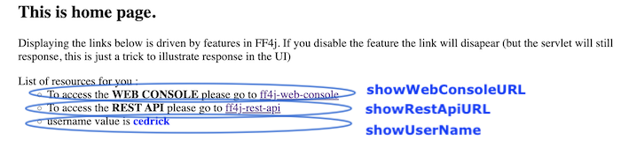
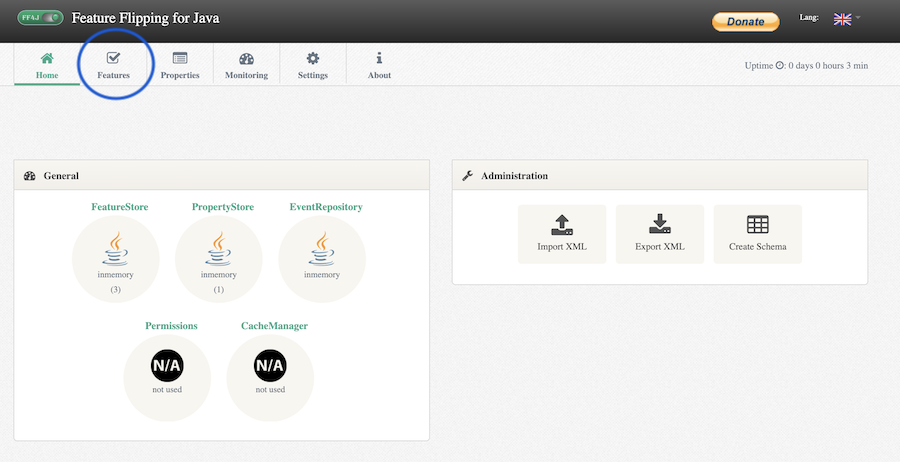
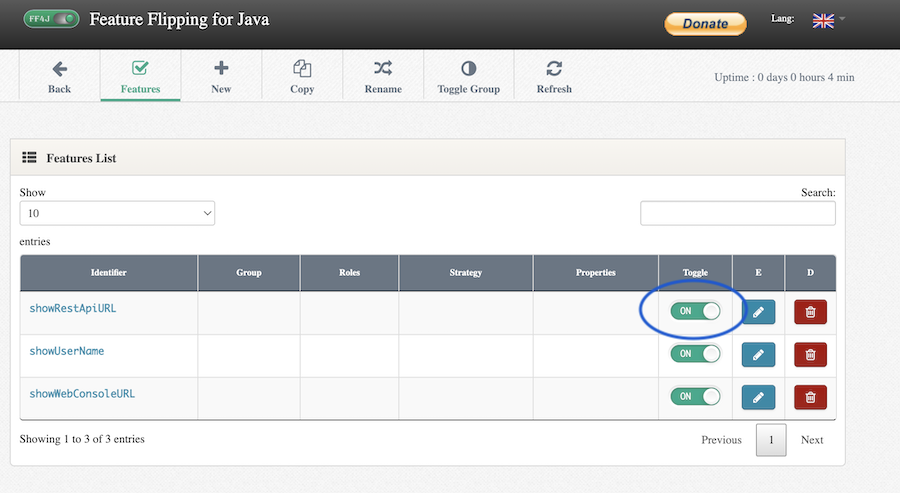
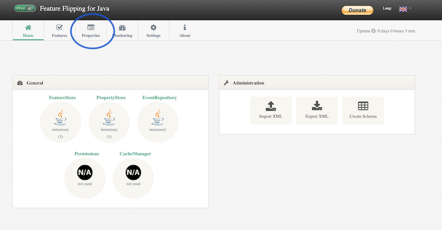
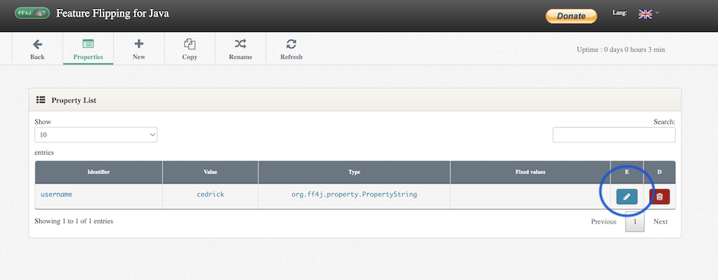
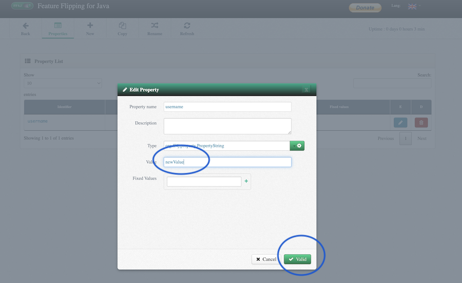
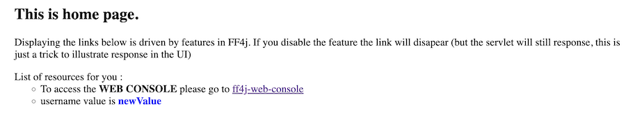
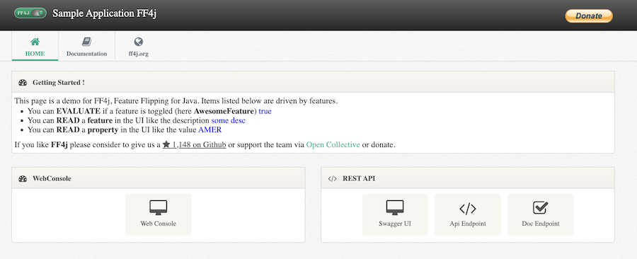

## Introductory Video

A 15-min video going over the main use cases and a demo with microservices. The associated [source code can be found here](https://github.com/ff4j/ff4j-samples/tree/master/spring-boot-1x/ff4j-voxxeddays-ticino-2018)


## Test with Docker

!!! abstract "Prerequisites"

    - Having [docker](https://docs.docker.com/engine/install/) installed

**✅ Step A.** - Having a `docker` engine on your machine, start a container with the following 

```
docker run -p 8080:8080 ff4j/ff4j-sample-springboot2x:1.8.5
```

> `👁️ Expected Console`
> 
> ```bash
>    _____  _____  _____     __ 
>  _/ ____\/ ____\/  |  |   |__|
>  \   __\\   __\/   |  |_  |  |
>   |  |   |  | /    ^   /  |  |
>   |__|   |__| \____   /\__|  |
>                    |__\______|
>
> Brought to you by FF4j Developments team
> If you like us, consider to give a ⭐ on github, that helps s! https://github.com/ff4j/ff4j/stargazers
> The application should be available on http://localhost:8080
> 15:30:17.803 INFO  org.ff4j.sample.Application                        : Starting Application v1.8.5 on 9a94abfcef56 with PID 1 (/app.jar started by root in /)
> 15:30:17.810 INFO  org.ff4j.sample.Application                        : No active profile set, falling back to default profiles: default
> 15:30:21.827 INFO  org.ff4j.sample.HomeController                     :  + Features and properties have been created for the sample.
> 15:30:24.181 INFO  org.ff4j.sample.Application                        : Started Application in 7.275 seconds (JVM running for 8.759)
> ```

**✅ Step B.** - Access: [http://localhost:8080](http://localhost:8080). In the basic web page you can see 3 bullets. 
Each is also a feature of the application that we will enable / disable. 

**✅ Step C.** - Click [web console link](http://localhost:8080/ff4j-web-console/home)



**✅ Step D.** - Click `Features` in the menu or `FeatureStore` in the General Tab to list features



**✅ Step E.** - Disable feature `showRestApiUrl` by clicking the toggle icon



**✅ Step F.** - Back, now select the `Properties` item in the menu.



**✅ Step G.** - Edit value of property `username` by click the pencil icon



**✅ Step H.** - Edit value of property `username` by click the pencil icon



**✅ Step I.** - Going back to the home page you see that only 2 lines are shown (one is disabled) and the property got a new value



_Your are done !_

## Spring-Boot Application

!!! abstract "Prerequisites"

    - Java 8+ installed
    - Maven Installed
    - Git installed (optional)

**✅ Step A.** - Download the code of the demo

- Execute the following `git` or [download as a zip](https://github.com/ff4j/ff4j-demo/archive/refs/heads/master.zip)

```
git clone https://github.com/ff4j/ff4j-demo.git
```

**✅ Step B.** - Start the demo

```bash
cd ff4j-demo
mvn spring-boot:run
```

**✅ Step C.** - Access the demo

- Test the running application on [localhost:8080](localhost:8080).  



- You should import the code in your IDE as a starting project. It is a spring boot application, it leverages the `spring-boot-starter`. The following dependency has been added to the `pom.xml`

```xml
<dependency>
  <groupId>org.ff4j</groupId>
  <artifactId>ff4j-spring-boot-starter</artifactId>
  <version>${ff4j.version}</version>
</dependency>
```

